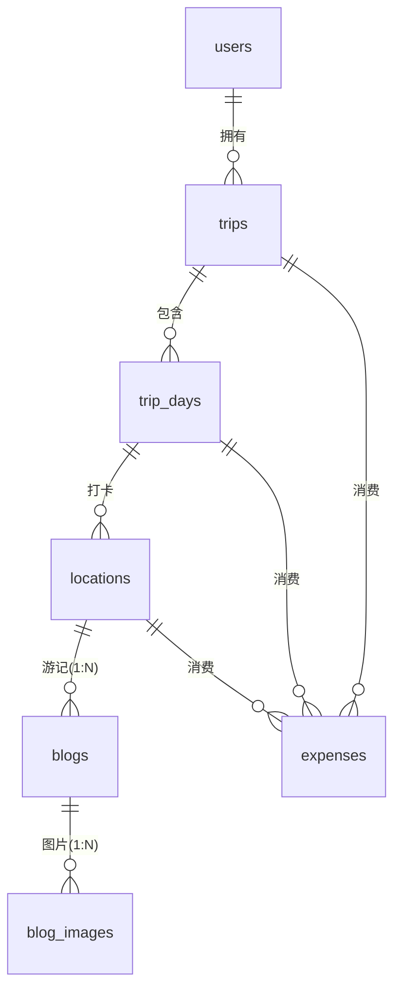

# 个人旅行足迹与游记管理系统 · 数据库设计文档

> 版本：V2 ｜ 数据库：MySQL 5.7 ｜ ORM：Prisma 6 ｜ 更新日期：2026-09-15

## 1. 设计目标

系统围绕"一次旅行 → 多个旅行日 → 多个打卡地点 → 游记/消费"的业务主线建模，共 **7 张表**。设计遵循：

- **三级级联**：用户 → 旅行 → 旅行日 → 地点 → 游记（图片），删除上级自动清理下级，保证数据一致性；
- **消费双归属**：消费记录同时关联「旅行日」与「地点」，既可按时序汇总，也可按地点归类；
- **一地多游记**：地点与游记为 1:N，支持一个地点沉淀多篇游记（如"白天"与"夜景"两篇）；
- **枚举约束**：地点类型使用数据库枚举，从源头杜绝"景点/景區/ATTRACTION"混杂的脏数据。

## 2. 实体关系（ER）



数据关联链路（也是权限校验链路）：

```
User
 └── Trip（userId）
      ├── TripDay（tripId）
      │    └── Location（tripDayId）
      │         └── Blog（locationId）→ BlogImage（blogId）
      └── Expense（tripId / tripDayId / locationId）
```

任何一次数据访问（读/写/删）都沿该链路校验归属，确保用户只能操作自己的数据。

## 3. 表结构设计

### 3.1 users（用户表）

| 字段 | 类型 | 约束 | 说明 |
|---|---|---|---|
| id | INT | PK, AUTO_INCREMENT | 用户 ID |
| email | VARCHAR(191) | UNIQUE, NOT NULL | 登录邮箱 |
| password | VARCHAR(191) | NOT NULL | bcrypt 加盐哈希（不存明文） |
| name | VARCHAR(191) | NOT NULL | 昵称 |
| avatar | VARCHAR(191) | NULL | 头像地址 |
| created_at | DATETIME | NOT NULL | 注册时间 |

### 3.2 trips（旅行表）

| 字段 | 类型 | 约束 | 说明 |
|---|---|---|---|
| id | INT | PK, AUTO_INCREMENT | 旅行 ID |
| title | VARCHAR(191) | NOT NULL | 旅行名称 |
| description | TEXT | NULL | 旅行简介 |
| cover | VARCHAR(191) | NULL | 封面图地址 |
| start_date | DATETIME | NULL | 开始日期 |
| end_date | DATETIME | NULL | 结束日期 |
| created_at | DATETIME | NOT NULL | 创建时间 |
| user_id | INT | FK → users.id, ON DELETE CASCADE | 所属用户 |

### 3.3 trip_days（旅行日表）

| 字段 | 类型 | 约束 | 说明 |
|---|---|---|---|
| id | INT | PK, AUTO_INCREMENT | 旅行日 ID |
| day_number | INT | NOT NULL | 第 N 天（同一旅行内唯一，自动 +1） |
| title | VARCHAR(191) | NULL | 当日行程标题 |
| date | DATETIME | NULL | 当天日期 |
| note | TEXT | NULL | 当日备注 |
| trip_id | INT | FK → trips.id, ON DELETE CASCADE | 所属旅行 |

### 3.4 locations（地点表）

| 字段 | 类型 | 约束 | 说明 |
|---|---|---|---|
| id | INT | PK, AUTO_INCREMENT | 地点 ID |
| name | VARCHAR(191) | NOT NULL | 地点名称 |
| country | VARCHAR(191) | NULL | 国家 |
| city | VARCHAR(191) | NULL | 城市 |
| lat | DOUBLE | NOT NULL | 纬度（范围 -90 ~ 90，已做后端校验） |
| lng | DOUBLE | NOT NULL | 经度（范围 -180 ~ 180，已做后端校验） |
| type | ENUM | NULL | 地点类型（9 类枚举，见 3.6） |
| note | TEXT | NULL | 打卡备注 |
| trip_day_id | INT | FK → trip_days.id, ON DELETE CASCADE | 所属旅行日 |

### 3.5 blogs / blog_images（游记表 / 游记图片表）

**blogs**

| 字段 | 类型 | 约束 | 说明 |
|---|---|---|---|
| id | INT | PK, AUTO_INCREMENT | 游记 ID |
| title | VARCHAR(191) | NOT NULL | 游记标题 |
| content | LONGTEXT | NOT NULL | 正文（Markdown 格式） |
| created_at / updated_at | DATETIME | NOT NULL | 创建 / 更新时间 |
| location_id | INT | FK → locations.id, ON DELETE CASCADE | 所属地点（一地多篇） |

**blog_images**

| 字段 | 类型 | 约束 | 说明 |
|---|---|---|---|
| id | INT | PK, AUTO_INCREMENT | 图片 ID |
| url | VARCHAR(191) | NOT NULL | 图片访问地址 |
| blog_id | INT | FK → blogs.id, ON DELETE CASCADE | 所属游记 |

### 3.6 地点类型枚举（LocationType）

| 枚举值 | 中文含义 |
|---|---|
| ATTRACTION | 景点 |
| RESTAURANT | 美食 |
| HOTEL | 住宿 |
| SHOPPING | 购物 |
| STATION | 车站 |
| AIRPORT | 机场 |
| PARK | 公园 |
| MUSEUM | 博物馆 |
| OTHER | 其他 |

> 使用数据库枚举而非自由字符串，保证筛选统计时的数据口径一致。

### 3.7 expenses（消费记录表）

| 字段 | 类型 | 约束 | 说明 |
|---|---|---|---|
| id | INT | PK, AUTO_INCREMENT | 消费 ID |
| category | VARCHAR(191) | NOT NULL | 分类：交通/住宿/餐饮/门票/购物/其他（应用层枚举） |
| amount | DECIMAL(10,2) | NOT NULL | 金额（后端校验 > 0 且 ≤ 1000 万） |
| note | VARCHAR(191) | NULL | 备注 |
| date | DATETIME | NULL | 消费时间（精确到分钟，24 小时制） |
| trip_id | INT | FK → trips.id, ON DELETE CASCADE | 所属旅行 |
| trip_day_id | INT | FK → trip_days.id, ON DELETE SET NULL | 所属旅行日（可空） |
| location_id | INT | FK → locations.id, ON DELETE SET NULL | 所属地点（可空） |

## 4. 索引设计

| 索引 | 表 | 列 | 用途 |
|---|---|---|---|
| PK（默认） | 全部 | id | 主键 |
| UQ | users | email | 登录查询、唯一约束 |
| idx_trip_user_created | trips | (user_id, created_at) | 首页"我的旅行"按用户+时间排序 |
| idx_trip_start_date | trips | start_date | 年份筛选 |
| idx_location_type | locations | type | 地点类型筛选 |
| idx_expense_category | expenses | category | 消费分类统计 |
| FK 索引（Prisma 自动） | 各表 | 外键列 | 关联查询 |

## 5. 级联删除策略

| 父表 → 子表 | 策略 | 场景说明 |
|---|---|---|
| users → trips | CASCADE | 注销账号时删除其全部旅行 |
| trips → trip_days | CASCADE | 删除旅行连带清理行程 |
| trips → expenses | CASCADE | 删除旅行连带清理消费 |
| trip_days → locations | CASCADE | 删除旅行日连带清理地点 |
| trip_days → expenses | SET NULL | 删除旅行日保留消费记录（关联置空） |
| locations → blogs | CASCADE | 删除地点连带清理游记 |
| locations → expenses | SET NULL | 删除地点保留消费记录（关联置空） |
| blogs → blog_images | CASCADE | 删除游记连带清理图片 |

> 设计要点：**业务明细数据（消费）在上级被删时采用 SET NULL 保留**，避免误删后统计断档；**结构数据（行程/地点/游记）采用 CASCADE**，避免留下无法访问的孤儿记录。

## 6. 迁移记录

| 迁移 | 内容 |
|---|---|
| 20260914145512_init | 建表：users / trips / trip_days / locations / blogs / blog_images / expenses |
| 20260914153157_add_expense_location | 消费表增加 location_id（消费归属地点） |
| 20260914160353_blog_many_per_location | 游记与地点改为 1:N（一地多篇） |
| 20260915123000_location_type_enum | 地点类型 String → Enum（存量中文值映射） |
| 20260915150000_add_indexes | 增加 4 个查询索引 |
